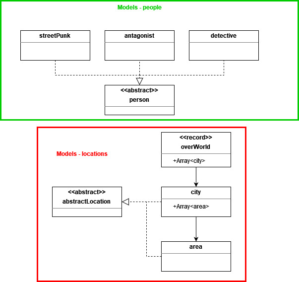

# Final Project

## Utvecklingsmiljö & Verktyg
Projektet genomfördes i följande miljöer:

+ Windows 10
+ IntelliJ IDEA Ultimate

Projektet genomfördes med hjälp av följande verktyg:

+ JDK 19.0.2
+ JDK 17.0.9
+ Apache Maven 3.9.1
+ Git 2.37.3.windows.1

## Syfte
Projektets syfte är att demonstrera ett program som implementerar designmönster och metoder från kursens tidigare laborationer
och moduler. För att göra detta så ska det grafiska ramverket *javax.swing* användas för att skapa ett separat fönster
där programmets data ska ritas ut.
Projektets konkreta krav är:

+  The command $ mvn clean verify needs to produce a working JAR.
+ The project must maintain an organized file structure, ensuring that each entity (be it a class, record, interface, etc.)
is located in its dedicated source document. The method main() should solely serve as the application's entry point and
not be involved in subsequent operations.
+ All models falls under sub package named models, views are placed under sub package views, and controller under sub
package controllers.
+ The application must feature a graphical user interface. For this task, the only permitted framework is Swing.
+ Your application needs to incorporate clear instructions on its use.
+ The design needs to conform to MVC pattern. There may be no direct communication between models and views, where all 
actions need to go through a controller. Models and views should have no notion about each other's existence.
+ All client / user interaction needs to go through a controller.
+ Communication back to the controller (from model and view) should be done using either callbacks or listeners.
+ No entity of the three roles Model, View, Controller may be implemented as globally accessed Singleton.

## metod
För att göra implementationen av projektet, så valdes det att bygga vidare på det text-baserade spelet som skapades
till projektet i kursen DT180G. Implementationens möjliga funktionaliteter brainstormades utifrån temat
'detektiv jagar tjuv' som sedan skulle inkluderas i spelet. Från dessa funktionaliteter så kunde programmets klasser
kartläggas, och en tidig överblick av projektets innehåll skapas.

## Genomförande
Genomförandet av projektet utfördes turordningen: **modell-klasser -> kontroller-klasser -> vy-klasser**.
Detta tillvägagångssätt valdes då modell-klasserna som innehåller programmets data är basen för och används av 
resten av projektet. Vy-klasserna skapades efteråt då dessa enbart har som uppgift att visa spelets information i det
grafiska gränssnittet. Därefter implementerades kontroller-klasserna eftersom de agerar som mellanhand för modell- och 
vy-klasserna.

### Modell-klasser
åääåöåA detailed explanation of the methods and techniques used to implement the solution.

Figur 1. Visar modell-klasserna som används i spelet.

gameInfo---

#### Personer

#### Spelets platser

### Vy-Klasser

### Kontroller-Klasser

### Problem under genomförandet

### test av implementation

## Diskussion
### Purpose Fulfillment/utvärdering av resultat
[replace this with relevant information]

### Alternativa lösningar
[replace this with relevant information]

## Personliga reflektioner
[replace this with relevant information]